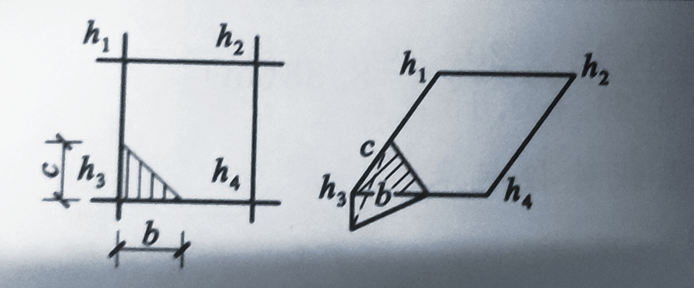
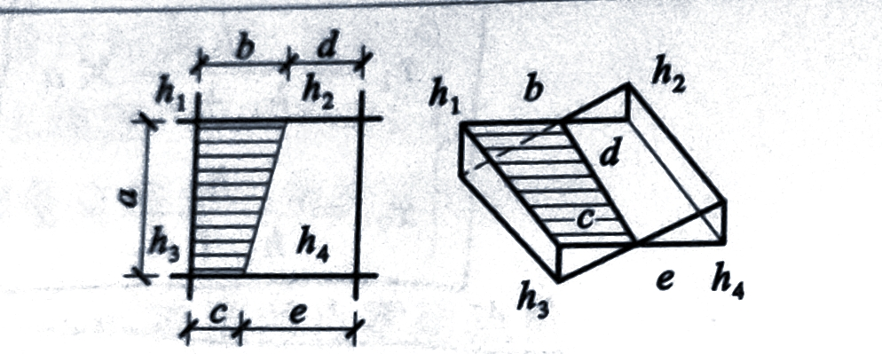
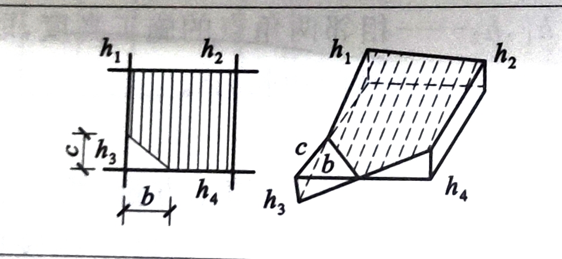
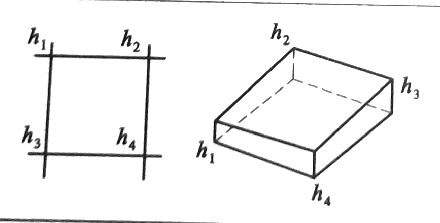
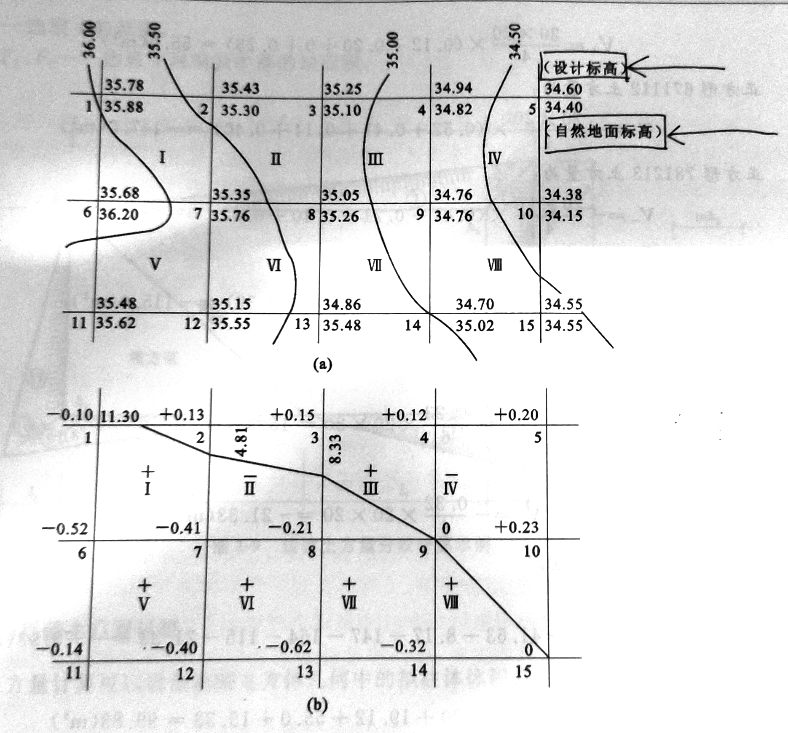

::: note 前提
### 常用方格网点的计算公式 

| 项目 | 图式 | 计算公式 |
| ---- | ---- | -------- |
| 一点填方或挖方（三角形） |  | $V=\dfrac{1}{2}bc\cdot\dfrac{\sum h}{3}=\dfrac{bc\,h_3}{6}$  当 $b=a=c$ 时，$V=\dfrac{a^{2}h_3}{6}$ |
| 四点填方或挖方（梯形） |  | $V_{+}=\frac{b+c}{2}a\cdot\frac{\sum h}{4}=\frac{a}{8}(b+c)(h_{1}+h_{3})$  $V_{-}=\frac{d+e}{2}a\cdot\frac{\sum h}{4}=\frac{a}{8}(d+e)(h_{2}+h_{4})$ |
| 三点填方或挖方（五边形） |  | $V=\left(a^{2}-\dfrac{bc}{2}\right)\dfrac{\sum h}{5} = \left(a^{2}-\dfrac{bc}{2}\right)\dfrac{h_1+h_2+h_4}{5}$
 |
| 四点填方或挖方（正方形） |  | $V=\frac{a^2}{4}\sum h=\frac{a^2}{4}(h_1+h_2+h_3+h_4)$ |

:::

## 例题

厂房场地平整，部分方格网如图所示，方格为 $20 \times 20 m$，试计算挖填总土方工程量。

:::steps

1. 划分方格网、标注高程

&emsp;&emsp;根据图里面的方格各点的设计标高和自然地面标高，计算方格各点的施工高度，标注于图中各点的左脚上。

2. 计算零点位置

&emsp;&emsp;从图中可以看出，$1——2$、$2——7$、$3——8$ 三条方格边两端角的施工高度符号不同，表明此方格边上有零点存在。由公式可得出一下结果。

&emsp;&emsp;$1——2$ 线：

$$
x_{1} = \frac{0.13 \times 20}{0.10 + 0.13 } = 11.30 (m)
$$

&emsp;&emsp;$2——7$ 线：

$$
x_{1} = \frac{0.13 \times 20}{0.41 + 0.13 } = 4.81 (m)
$$

&emsp;&emsp;$3——8$ 线：

$$
x_{1} = \frac{0.15 \times 20}{0.21 + 0.15 } = 8.33 (m)
$$

&emsp;&emsp;将各零点标注于图上，并将零点线连接起来。

3. 计算土方工程量

&emsp;&emsp;方格 $I$ 底面三角形和五边形，由表中的公式可得：

&emsp;&emsp;三角形 $200$ 土方量为：

$$
V_{+} = \frac{0.13}{6} \times 11.03 \times 4.81 = 1.18 (m^3)
$$

&emsp;&emsp;五边形 $16700$ 土方量为：

$$
V_{-} = - (20^2 - \frac{1}{2} \times 11.30 \times 4.81) \times (\frac{0.10 + 0.52 + 0.41}{5}) = - 76.8 (m^3)
$$

&emsp;&emsp;方格 $II$ 底面为两个梯形，由表中的公式可得：

&emsp;&emsp;梯形 $2300$ 土方量为：

$$
V_{+} = \frac{20}{8} \times (4.81 + 8.33) \times (0.13 + 0.15) = 9.20 (m^3)
$$

&emsp;&emsp;梯形 $7800$ 土方量为：

$$
V_{-} = - \frac{20}{8} \times (15.19 + 11.67) \times (0.41 + 0.21) = - 41.63 (m^3)
$$

&emsp;&emsp;方格 $III$ 底面为一个梯形和一个三角形，由表中的公式可得：

&emsp;&emsp;梯形 $3400$ 土方量为：

$$
V_{+} = \frac{20}{8} \times (8.33 + 20) \times (0.15 + 0.12) = 19.12 (m^3)
$$

&emsp;&emsp;三角形 $800$ 土方量为：

$$
V_{-} = - \frac{11.67 \times 20}{6} \times 0.21 = - 8.17 (m^3)
$$

&emsp;&emsp;方格 $IV$、$V$、$VI$、$VII$底面均为正方形，由表中的公式可得：

&emsp;&emsp;正方形 $45910$ 土方量为：

$$
V_{+} = \frac{20^2}{4} \times (0.12 + 0.20 + 0 + 0.23) = 55.00 (m^3)
$$

&emsp;&emsp;正方形 $671112$ 土方量为：

$$
V_{-} = - \frac{20^2}{4} \times (0.52 + 0.41 + 0.14 + 0.40) = - 147.00 (m^3)
$$

&emsp;&emsp;正方形 $781213$ 土方量为：

$$
V_{-} = - \frac{20^2}{4} \times (0.41 + 0.21 + 0.40 + 0.62) = - 164.00 (m^3)
$$

&emsp;&emsp;正方形 $891314$ 土方量为：

$$
V_{-} = - \frac{20^2}{4} \times (0.21 + 0 + 0.32 + 0.62) = - 115.00 (m^3)
$$

&emsp;&emsp;方格 $VIII$ 底面为两个三角形，由表中的公式可得：

&emsp;&emsp;三角形 $91015$ 土方量为：

$$
V_{+} = \frac{0.23}{6} \times 20 \times 20 = 15.33 (m^3)
$$

&emsp;&emsp;三角形 $91415$ 土方量为：

$$
V_{-} = - \frac{0.32}{6} \times 20 \times 20 = - 21.33 (m^3)
$$

4. 汇总全部计算结果

&emsp;&emsp;全部挖方量：

$$
\sum V_{-} = - (76.8 + 41.63 + 8.17 + 147 + 164 + 115 + 21.33) = - 573.93 (m^3)
$$

&emsp;&emsp;全部填方量：

$$
\sum V_{+} = 1.18 + 9.20 + 19.12 + 55 + 15.33 = 99.83 (m^3)
$$
:::